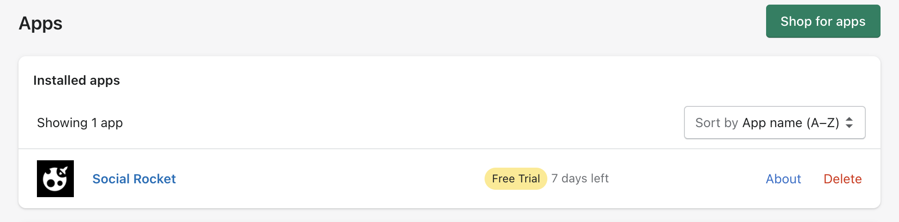

# Social Rocket

<p align="center">
      
</p>

## Requirements

- PHP >= 7.4

## Getting started

### Dependencies installation

*(Assuming you've [installed Composer](https://getcomposer.org/doc/00-intro.md))*

Fork this repository, then clone your fork, and run this in your newly created directory:

``` bash
composer install
```

### Project configuration

Next you need to make a copy of the `.env.example` file and rename it to `.env` inside your project root.

Run the following command to generate your app key:

``` bash
php artisan key:generate
```

Run the database migrations (**Set the [database connection](https://laravel.com/docs/8.x/database#configuration) in .env before migrating**)

``` bash
php artisan migrate && php artisan db:seed
```

Then start your server:

``` bash
php artisan serve
```
You can now access the server at http://127.0.0.1:8000

To see all defined routes and corresponding controllers methods use `php artisan route:list` console command

Queue listen

``` bash
php artisan queue:work --timeout=2000 --sleep=3 --tries=3 --daemon
```

Run scheduled commands

``` bash
php artisan schedule:run
```
---
## Preparing to submit your app



The official shopify building apps documentation include how to prepare your shopify app for review.

You can follow next [steps](https://www.shopify.co.uk/partners/blog/how-to-build-a-shopify-app#prepare-submit) to get approved.

## Shopify API Config variables

- SHOPIFY_API_KEY

- SHOPIFY_API_SECRET

## Zendesk Config variables

- ZENDESK_KEY

- HELP_URL

    `Set your zendesk help/guide page url`

- SETUP_GUIDE

    `Set setup guide page url will be included in affiliate iframe settings`
